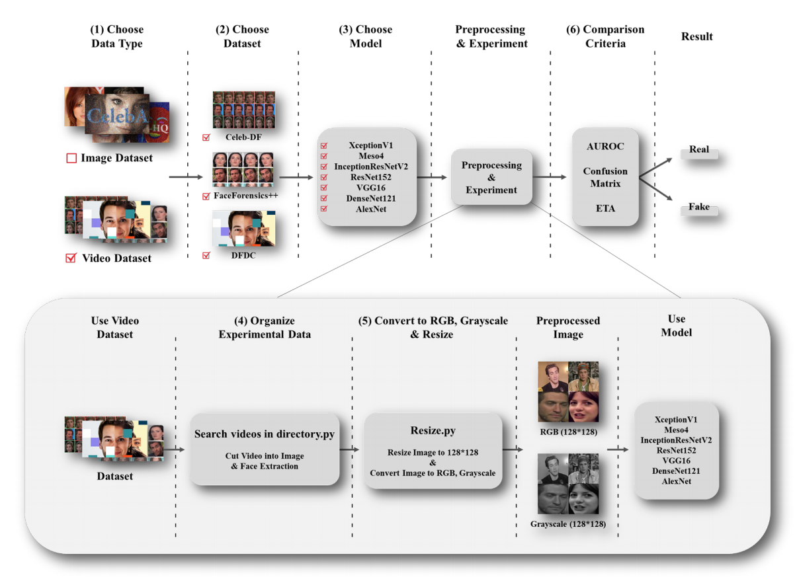

# Deepfake Video Detection
In this project, the performance on detection was compared and analyzed using color channels.  

```
1. 주요내용 : Gray 색상 기반의 딥러닝 기반의 딥페이크 영상 탐지
2. 본인이 기여한점: 데이터셋 학습 및 평가를 위한 model 기반 코드(AlexNet, DenseNet, InceptionResNetV2, MesoNet, ResNet152, VGG, Xception) 작성
3. 사용한 Skill: python
4. 어려웠던점: 방대한 데이터셋을 가공하는 부분과 데이터를 학습 및 평가를 진행하는 부분에 큰 힘을 쏟았습니다.
5. 결과 : 사용 데이터셋에 모델을 적용하여 학습 및 평가를 진행하였습니다.
6. 업적 : 소프트웨어 1저자
7. 기간 : 1년 9개월(6개월 - 기획 및 데이터셋 확보, 1년 3개월 - 개발 및 논문 작성)
```

## 0. Used Dataset & models

```
사용한 dataset: DFDC, FaceForensics++, Celeb-DF  
사용된 model: AlexNet, DenseNet, InceptionResNetV2, MesoNet, ResNet152, VGG, Xception
```

<br>

## 1. Progress




## 2. How to start?

1. Download Datasets

   ```
   1. celeb-DF: http://www.cs.albany.edu/~lsw/celeb-deepfakeforensics.html
   2. DFDC: https://dfdc.ai/
   3. FaceForensics++: https://github.com/ondyari/FaceForensics
   ```

2. Download python code for converting videos to images

- We used some codes in [Debanik/Detecting-Deepfakes](https://github.com/Debanik/Detecting-Deepfakes)
- To extract frames, used python codes are
  `extract_faces.py, res10_300x300_ssd_iter_140000.caffemodel, search_videos_in_directory.py`.
  Additionaly, We changed code `search.py`.

3. Download Requirements.txt and download requirements.

   ```
   pip install -r requirements.txt
   ```

4. Make up Directories Structures whatever you want.
   ```
   ㄴCD_RGB
   ㄴCD_Gray
   ㄴDFDC_RGB
   ㄴDFDC_Gray
   ㄴFF_RGB
    ㄴFF_Gray
    ㄴCeleb-DF-frames
   ㄴFaceForensics++-frames
   ㄴDFDC-frames
   ```
   <div></div>

## 3. Preprocessing Requirements

   ```
   deploy.prototxt.txt           extract_faces_keep_in_mem.py
   extract_faces.py              requirements.txt
   res10_300x300_ssd_iter_140000.caffemodel
   search_videos_in_directory_keep_in_mem.py
   search_videos_in_directory.py
   ```

   `extract*.py, res*.coffeemodel, search\_\*.py, deploy.proto\*.txt` are from [Debanik/Detecting-Deepfakes](https://github.com/Debanik/Detecting-Deepfakes).  
   we changed search_videos\*.py

## 4. Start Experiments
   ```
   1. Preprocessing 
   $ python3 search_videos_in_directory.py
   -> input directory: (your dataset path)
   -> output directory: ex) fake_test or fake_train or real_test or real_train 
   -> video files: 50 #Each video was cut into 50 frames.
   2. python VGG16.py
   -> You can use AlexNet, DenseNet, InceptionResNetV2, MesoNet, ResNet152, VGG, Xception
   3. Get AUROC, Accuracy, f1-score
   ```
